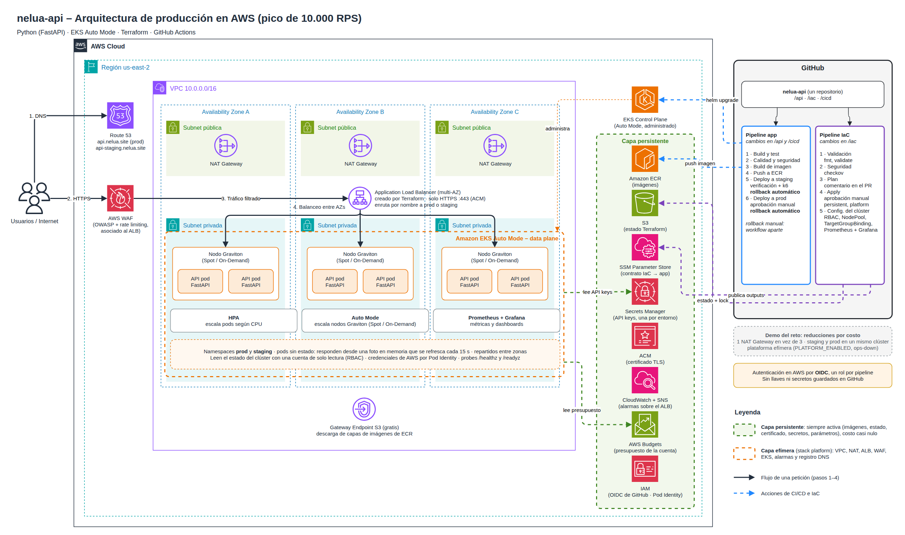

# nelua-api

API REST para un equipo de infraestructura. Responde tres cosas: qué está roto,
qué cambió hace poco y cuánto se lleva gastado. Los datos son reales. Los lee del
clúster de Kubernetes donde corre y de los presupuestos de la cuenta de AWS.

Es mi solución al reto técnico *DevOps & Platform Engineering*. La API, la
infraestructura en AWS y los pipelines funcionan.

| Carpeta | Qué hay |
|---|---|
| [`api/`](api) | Código en FastAPI, pruebas, `Dockerfile`, `docker-compose.yml` y el chart de Helm |
| [`iac/`](iac) | Terraform (red, EKS, ALB, WAF, IAM, secretos, alarmas) y los manifiestos del clúster |
| [`cicd/`](cicd) | Scripts de despliegue y rollback, pruebas de carga y la [explicación de los pipelines](cicd/README.md) |
| [`.github/workflows/`](.github/workflows) | Los pipelines, en GitHub Actions |
| [`run.md`](run.md) | Cómo correrlo en local y cómo desplegarlo |
| [`docs/decisiones.md`](docs/decisiones.md) | Por qué está hecho así, qué alternativas vi y qué sacrifiqué |
| [`prompts.md`](prompts.md) | Cómo usé IA en el reto |

## Probarlo

```bash
cd api
cp .env.example .env
docker compose up --build
```

```bash
curl -s -H "X-API-Key: cambia-esta-llave-local" localhost:8000/v1/summary
```

En local no hay clúster ni cuenta de AWS, así que la API responde con una foto de
ejemplo. Cuando está desplegada usa las fuentes reales. El detalle está en
[`run.md`](run.md).

## La API

| Endpoint | Para qué |
|---|---|
| `GET /v1/summary` | Panorama general: nodos, servicios por estado, presupuesto y cuántas alertas hay |
| `GET /v1/alerts` | Problemas activos, ordenados del más grave al menos grave |
| `GET /v1/deployments` | Qué hay desplegado: réplicas, versión, pods, autoescalado e historial de despliegues |
| `GET /v1/budget` | Presupuesto de AWS: límite, gasto, pronóstico y estado |
| `GET /healthz`, `/readyz`, `/metrics` | Operación: liveness, readiness y métricas para Prometheus |

Los endpoints bajo `/v1` piden el encabezado `X-API-Key`. Todos los errores usan
el mismo formato, el de la RFC 9457 (`application/problem+json`). Cada respuesta
trae `meta.collected_at` y `meta.stale`, que dicen qué tan reciente es el dato.
La documentación interactiva queda en `/docs`.

## La arquitectura



El diagrama es el diseño de producción. Para el reto desplegué una versión
reducida por costo (por ejemplo, un NAT Gateway en vez de tres). Las diferencias
están en [`docs/decisiones.md`](docs/decisiones.md#producción-y-demo) y el archivo
editable es [`docs/arquitectura.drawio`](docs/arquitectura.drawio).

En resumen:

- Solo está abierto el puerto 443, con certificado de ACM. Delante hay un WAF con
  límite por IP y reglas administradas. Los pods no tienen IP pública.
- Hay tres zonas y mínimo tres réplicas repartidas entre ellas. Los despliegues no
  tumban el servicio.
- La API no tiene estado y responde desde memoria. Para llegar a 10.000 RPS
  escalan los pods (HPA) y los nodos (EKS Auto Mode).
- No hay secretos en el código ni en GitHub. Los pipelines entran a AWS por OIDC,
  la API usa Pod Identity y las llaves están en Secrets Manager.

El porqué de cada cosa está en [`docs/decisiones.md`](docs/decisiones.md).

## CI/CD

Son dos pipelines independientes. Cada uno se dispara solo cuando cambia lo suyo.

| Pipeline | Grupo | Etapas |
|---|---|---|
| Aplicación | CI | Build y test, calidad y seguridad, build de imagen, push al registry |
| | CD | Deploy a staging, deploy a producción (con aprobación) |
| Infraestructura | Revisión | Validación, seguridad, plan |
| | Aplicación | Apply (con aprobación), configuración del clúster |

El rollback tiene tres niveles. Helm revierte si el despliegue no termina bien. Si
termina pero la verificación falla, un paso del pipeline vuelve a la versión
anterior. Y hay un workflow manual para revertir en cualquier momento. Está
explicado en [`cicd/README.md`](cicd/README.md).
