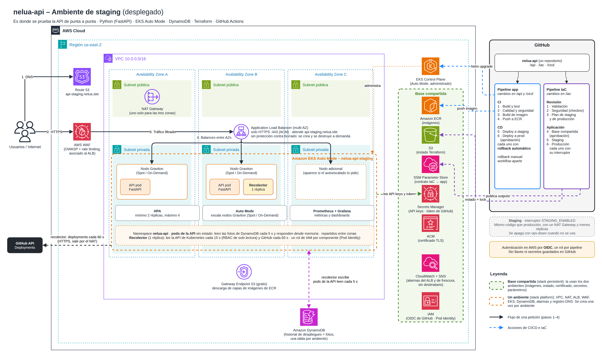
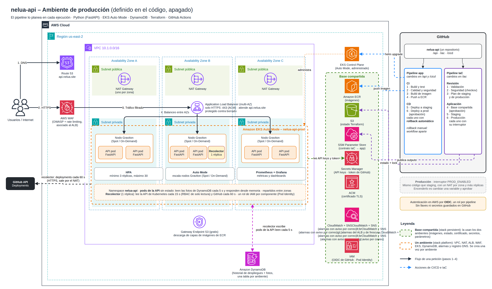

# nelua-api

API REST para un equipo de plataforma. Responde tres preguntas: cómo vienen
saliendo los despliegues de un repositorio (los últimos y su tasa de éxito,
sacados de GitHub), en qué estado están los servicios en Kubernetes, por
namespace, y cuánto se lleva gastado frente al presupuesto de AWS.

Las fuentes son externas y lentas comparadas con 10.000 RPS, así que la API no las
consulta en cada petición. Un recolector las lee cada pocos segundos, guarda el
historial y una foto ya calculada en DynamoDB, y los pods de la API responden
desde memoria.

**Si tienes 5 minutos, empieza por [`docs/decisiones.md`](docs/decisiones.md):** cada
objetivo del reto con cómo lo resolví, los resultados medidos y los trade-offs.

| Carpeta | Qué hay |
|---|---|
| [`api/`](api) | Código en FastAPI, pruebas, `Dockerfile`, `docker-compose.yml` y el chart de Helm |
| [`iac/`](iac) | Terraform (red, EKS, ALB, WAF, DynamoDB, IAM, secretos, alarmas) y los manifiestos del clúster |
| [`cicd/`](cicd) | Scripts de despliegue y rollback, pruebas de carga y la [explicación de los pipelines](cicd/README.md) |
| [`.github/workflows/`](.github/workflows) | Los pipelines, en GitHub Actions |
| [`run.md`](run.md) | Cómo correrlo en local y cómo desplegarlo |
| [`postman/`](postman) | Colección de Postman para probar staging |
| [`docs/decisiones.md`](docs/decisiones.md) | Cada objetivo y cómo lo resolví, resultados medidos, alternativas y trade-offs |
| [`docs/`](docs) | Informes de la prueba de carga y de observabilidad (Word) |
| [`prompts.md`](prompts.md) | Cómo usé IA en el reto |

## Probarlo

### En local

```bash
cd api
cp .env.example .env
docker compose up --build
```

```bash
curl -s -H "X-API-Key: cambia-esta-llave-local" localhost:8000/v1/repos/londono652/nelua-api/deploys/stats
```

Levanta tres contenedores: DynamoDB Local, el recolector y la API. En local no hay
clúster ni cuenta de AWS, así que el estado de Kubernetes, los despliegues y el
presupuesto son datos de ejemplo.
Los despliegues pueden ser los reales de GitHub cambiando una variable en `.env`.
El detalle está en [`run.md`](run.md).

### Contra staging, desplegado en AWS

La API está en `https://api-staging.nelua.site`. Los endpoints bajo `/v1` piden la
API key en el encabezado `X-API-Key`; la llave se entrega por correo y no está en
el repositorio.

```bash
U=https://api-staging.nelua.site
KEY='<la llave del correo>'

curl -s $U/healthz                                                        # versión desplegada, sin llave
curl -s -H "X-API-Key: $KEY" $U/v1/repos                                  # repos monitoreados
curl -s -H "X-API-Key: $KEY" "$U/v1/repos/londono652/nelua-api/deploys?environment=staging&limit=5"
curl -s -H "X-API-Key: $KEY" "$U/v1/repos/londono652/nelua-api/deploys/stats?days=7"
curl -s -H "X-API-Key: $KEY" $U/v1/deployments                            # estado en Kubernetes
curl -s -H "X-API-Key: $KEY" $U/v1/budget                                 # gasto del mes en AWS
```

Y tres errores esperados, todos con el formato RFC 9457:

```bash
curl -s $U/v1/repos                                                       # 401: sin llave
curl -s -H "X-API-Key: $KEY" $U/v1/repos/otro/repo/deploys                # 404: repo no monitoreado
curl -s -H "X-API-Key: $KEY" "$U/v1/repos/londono652/nelua-api/deploys/stats?days=15"  # 422
```

Con `| jq` se leen mejor. La documentación interactiva está en `$U/docs`.

**Postman:** importa [`postman/nelua-api-staging.postman_collection.json`](postman/nelua-api-staging.postman_collection.json),
pega la llave en la variable `apiKey` de la colección y usa *Run collection*: son
12 peticiones con 29 pruebas, incluidos los tres errores.

## La API

| Endpoint | Para qué |
|---|---|
| `GET /v1/repos` | Repositorios monitoreados y qué tan recientes son sus datos |
| `GET /v1/repos/{owner}/{repo}/deploys` | Últimos despliegues: ambiente, estado, commit, autor, duración y enlace a la ejecución. Filtros `environment` y `limit` |
| `GET /v1/repos/{owner}/{repo}/deploys/stats` | Tasa de éxito, tasa de fallos (la de DORA), despliegues por día y duración promedio, en 7 o 30 días (`days`), por ambiente |
| `GET /v1/budget` | Presupuesto de la cuenta de AWS: límite, gasto del mes, pronóstico al cierre y estado (`ok`, `warning`, `exceeded`) |
| `GET /v1/deployments` | Estado de los deployments por namespace: réplicas, versión, pods, autoescalado e historial de revisiones (ahí se ven los rollbacks). Filtros `namespace`, `name` y `status` |
| `GET /healthz`, `/readyz`, `/metrics` | Operación: liveness, readiness y métricas para Prometheus |

Los repositorios se configuran en una lista (`githubRepos` en el chart, `GITHUB_REPOS`
en local). Un `owner/repo` que no esté en ella responde 404 sin llegar a GitHub. Así
nadie puede gastar el límite de peticiones del token pidiendo repos al azar.

Los endpoints bajo `/v1` piden credenciales. En local y staging es el encabezado
`X-API-Key`. En producción es un token de Cognito (`Authorization: Bearer`), que el
balanceador valida antes de que la petición llegue a la API. Todos los errores usan
el mismo formato, el de la RFC 9457 (`application/problem+json`). Cada respuesta
trae `meta.collected_at` y `meta.stale`, que dicen qué tan reciente es el dato, y
`meta.sync`, que dice si el recolector está logrando sincronizar con la fuente y,
si no, por qué. Si deja de sincronizar, también salta una alarma en CloudWatch.
La documentación interactiva queda en `/docs`.

## La arquitectura

Hay dos ambientes, staging y producción. Cada uno tiene su red, su clúster y su
balanceador, y los crea el mismo código de Terraform con un archivo de valores
distinto. Por eso los dos diagramas son casi iguales: cambian la cantidad de NAT
Gateways, las réplicas y la protección del balanceador.

**Staging** es el que desplegué para el reto, y donde probé la API de punta a punta.



**Producción** está definida en el código y el pipeline la planea en cada
ejecución, pero queda apagada para no pagar dos clústeres.



Las diferencias entre los dos están explicadas en
[`docs/decisiones.md`](docs/decisiones.md#staging-y-producción). Los archivos
editables de los diagramas están en [`docs/`](docs).

En resumen:

- Solo está abierto el puerto 443, con certificado de ACM. Delante hay un WAF con
  límite por IP y reglas administradas. Los pods no tienen IP pública.
- Hay tres zonas y, en producción, mínimo tres réplicas repartidas entre ellas.
  Los despliegues no tumban el servicio.
- La API responde desde memoria para llegar a 10.000 RPS
  escalan los pods (HPA) y los nodos (EKS Auto Mode). La carga sobre las fuentes
  y DynamoDB no crece con el tráfico: GitHub, Kubernetes y AWS Budgets los
  consulta solo el recolector, y cada pod lee DynamoDB una vez cada 5 segundos.
- En producción cada consumidor tiene su cliente de Cognito y pide tokens de una
  hora; el ALB los valida y rechaza el tráfico sin token antes de llegar a los pods.
- No hay secretos en el código ni en GitHub. Los pipelines entran a AWS por OIDC,
  los pods usan Pod Identity y las llaves y el token de GitHub están en Secrets
  Manager. La API y el recolector tienen roles distintos: la API solo lee.
- Hay SLOs de disponibilidad (99,9 %), latencia (99 % bajo 300 ms) y frescura de
  los datos (99 %). Las alarmas de CloudWatch avisan por consumo del presupuesto
  de error, no por umbrales sueltos, y cada ambiente tiene un tablero de SLOs.
- Hay trazas distribuidas con OpenTelemetry y AWS X-Ray. Cada ciclo del recolector
  es una traza con sus llamadas a GitHub, Kubernetes y DynamoDB, y los logs llevan
  el mismo `trace_id`.

El porqué de cada cosa está en [`docs/decisiones.md`](docs/decisiones.md).

## CI/CD

Son dos pipelines independientes. Cada uno se dispara solo cuando cambia lo suyo.

| Pipeline | Grupo | Etapas |
|---|---|---|
| Aplicación | CI | Build y test, calidad y seguridad, build de imagen, push al registry |
| | CD | Deploy a staging, deploy a producción (con aprobación) |
| Infraestructura | Revisión | Validación, seguridad, plan de los dos ambientes |
| | Aplicación | Base compartida (con aprobación), staging, producción |

El rollback tiene tres niveles. Helm revierte si el despliegue no termina bien. Si
termina pero la verificación falla, un paso del pipeline vuelve a la versión
anterior. Y hay un workflow manual para revertir en cualquier momento. Está
explicado en [`cicd/README.md`](cicd/README.md).
