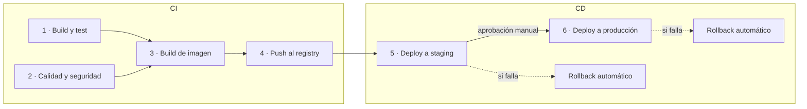
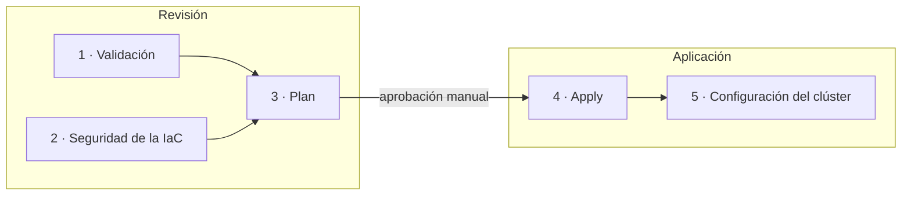

# CI/CD

Hay dos pipelines en el mismo repositorio y cada uno se dispara solo cuando cambia
lo suyo. Un cambio en la API no toca la infraestructura, y al revés.

| Pipeline | Se dispara con cambios en | Grupos | Definición |
|---|---|---|---|
| Aplicación | `api/**`, `cicd/**` | CI y CD | [`app.yml`](../.github/workflows/app.yml) llama a [`app-ci.yml`](../.github/workflows/app-ci.yml) y a [`app-cd.yml`](../.github/workflows/app-cd.yml) |
| Infraestructura | `iac/**` | Revisión y Aplicación | [`infra.yml`](../.github/workflows/infra.yml) llama a [`infra-review.yml`](../.github/workflows/infra-review.yml) y a [`infra-apply.yml`](../.github/workflows/infra-apply.yml) |
| Rollback manual | A demanda | | [`rollback.yml`](../.github/workflows/rollback.yml) |

GitHub Actions no tiene "stages" como otras herramientas. Para que los grupos se
vean en el gráfico de cada ejecución, cada pipeline tiene un archivo que orquesta
y un workflow reutilizable por grupo. GitHub dibuja cada llamado como un bloque
con sus etapas adentro.

Los workflows tienen que estar en `.github/workflows/` porque GitHub lo exige. En
esta carpeta está el resto: los scripts que ejecutan las etapas (`scripts/`) y las
pruebas de humo y de carga (`load-tests/`). Los scripts también corren a mano, sin
GitHub.

## Pipeline de la aplicación

CI termina cuando hay una imagen probada, escaneada y publicada. CD empieza cuando
esa imagen se despliega.

| Grupo | Etapa | Qué hace | Qué la hace fallar |
|---|---|---|---|
| CI | 1 · Build y test | Instala dependencias, corre las pruebas con `pytest` y valida el chart de Helm | Una prueba rota o un chart inválido |
| CI | 2 · Calidad y seguridad | `ruff` (estilo, errores y las reglas de seguridad de bandit) y Trivy sobre el repositorio, que busca dependencias vulnerables y secretos escritos en el código | Código que no pasa el linter, una dependencia con vulnerabilidad alta o crítica que ya tiene corrección, o un secreto en el repo |
| CI | 3 · Build de imagen | Construye la imagen `arm64` y la escanea con Trivy | Una vulnerabilidad alta o crítica con corrección disponible |
| CI | 4 · Push al registry | Publica en ECR la imagen que se escaneó, con el SHA del commit como tag | |
| CD | 5 · Deploy a staging | Despliega con Helm, verifica la versión y corre una prueba de humo con k6 | Pods que no arrancan, versión incorrecta, errores o latencia alta |
| CD | 6 · Deploy a producción | Lo mismo que en staging, después de una aprobación manual | Lo mismo |

En un pull request corre CI hasta la etapa 3. Se valida todo, pero no se publica
ni se despliega.

Algunas cosas que conviene saber del pipeline:

- No guarda llaves. Entra a AWS por OIDC y asume un rol que solo puede publicar en
  su repositorio de ECR y desplegar en sus dos namespaces.
- La imagen se construye una sola vez. La que pasa el escaneo viaja como artefacto
  a la etapa de push, así que lo que se probó en staging es lo mismo que llega a
  producción.
- El tag es el SHA del commit y ECR no deja sobrescribirlo.
- No conoce la infraestructura. El nombre del clúster, la URL del registry, los
  dominios y el nombre del secreto los lee de Parameter Store (`/nelua-api/...`).

## Estrategia de rollback

Como las imágenes son inmutables y siguen en el registry, volver atrás no
reconstruye nada. Es apuntar otra vez a una versión que ya funcionó. Hay tres
niveles.

| Nivel | Cuándo actúa | Cómo | Quién lo dispara |
|---|---|---|---|
| 1. Durante el despliegue | Los pods nuevos no arrancan o no pasan el health check | `helm upgrade --wait --rollback-on-failure`: Helm deshace el cambio | Automático |
| 2. Después del despliegue | Los pods arrancaron, pero falla la verificación de versión o la prueba de humo | El paso "Rollback automático" del pipeline hace `helm rollback` a la revisión anterior y vuelve a verificar | Automático |
| 3. Más tarde | El problema aparece cuando el pipeline ya terminó en verde | Workflow `rollback`, con el botón *Run workflow*. Se elige el entorno y, si se quiere, la revisión | Una persona |

Antes de llegar a esos niveles hay dos protecciones. El despliegue es gradual, con
`maxUnavailable: 0`, así que los pods viejos solo se retiran cuando los nuevos
pasan el readiness. Una versión que no arranca no tumba el servicio. Y producción
solo recibe lo que ya pasó por staging, con aprobación manual.

Sobre el nivel 2:

- Antes de desplegar, `deploy.sh` anota qué revisión está sirviendo. El rollback
  vuelve a esa revisión, no a "la anterior que haya".
- El rollback no se da por bueno hasta que `verify.sh` confirma que el entorno
  responde con la versión restaurada.
- El pipeline queda en rojo aunque el rollback salga bien. El entorno está sano,
  pero la versión nueva no pasó y no sigue hacia producción.
- Es un paso dentro del mismo job. Si fuera un job aparte en `prod`, volvería a
  pedir aprobación, y revertir no debería esperar a nadie.

El rollback no cubre cambios de datos. Esta API es de solo lectura y no tiene base
de datos, así que no hay migraciones que deshacer. Si las hubiera, tendrían que
ser compatibles hacia atrás para que revertir el código siguiera siendo seguro.

Un rollback se puede ver desde la API. En `GET /v1/deployments`, el historial del
servicio muestra la revisión activa con `reactivated: true`.

## Pipeline de infraestructura

Aquí los grupos no se llaman CI y CD, porque no se construye ni se despliega un
artefacto. Revisión es lo que pasa antes de que alguien apruebe, y no crea ni
modifica nada. Aplicación es el cambio.

| Grupo | Etapa | Qué hace |
|---|---|---|
| Revisión | 1 · Validación | `terraform fmt -check` y `terraform validate` de los tres stacks |
| Revisión | 2 · Seguridad de la IaC | `checkov`. Las excepciones están justificadas junto a cada recurso |
| Revisión | 3 · Plan | `terraform plan` por stack. En un pull request se publica como comentario |
| Aplicación | 4 · Apply | Después de la aprobación: stack `persistent` y, si `PLATFORM_ENABLED` es `true`, stack `platform` |
| Aplicación | 5 · Configuración del clúster | Namespaces, pool de nodos, permisos de lectura de la API, enlace con el ALB y monitoreo |

El stack `bootstrap` no se aplica desde el pipeline. Crea el bucket del estado y
los roles con los que el pipeline entra a AWS, así que se aplica a mano una vez.
El pipeline solo lo valida.

En infraestructura, el rollback es un `git revert` del cambio y otra pasada por el
pipeline. El plan muestra qué se va a deshacer antes de aprobarlo.

## Scripts

| Script | Uso |
|---|---|
| `scripts/deploy.sh <entorno> <tag>` | Despliega una versión con Helm |
| `scripts/verify.sh <entorno> [versión]` | Comprueba la versión y los endpoints desde la URL pública |
| `scripts/smoke.sh <entorno>` | Prueba de humo con k6 |
| `scripts/rollback.sh <entorno> [revisión]` | Vuelve a una revisión anterior y verifica |
| `load-tests/run-in-cluster.sh` | Prueba de carga de 10.000 RPS desde dentro del clúster |

## Configuración del repositorio

Variables, en *Settings > Secrets and variables > Actions > Variables*:

| Variable | Valor |
|---|---|
| `AWS_APP_ROLE_ARN` | Rol del pipeline de la aplicación (salida `gha_app_role_arn` del stack bootstrap) |
| `AWS_INFRA_ROLE_ARN` | Rol del pipeline de infraestructura (salida `gha_infra_role_arn`) |
| `PLATFORM_ENABLED` | `true` para crear el clúster. Con `false` queda apagado |
| `DEPLOY_ENABLED` | `true` para desplegar. Necesita la plataforma encendida |

Environments, en *Settings > Environments*: `staging`, `prod` e `infra`. Los dos
últimos llevan *Required reviewers*.

En GitHub no hay secretos guardados, ni llaves de AWS ni la API key.
