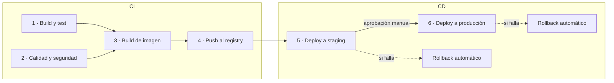
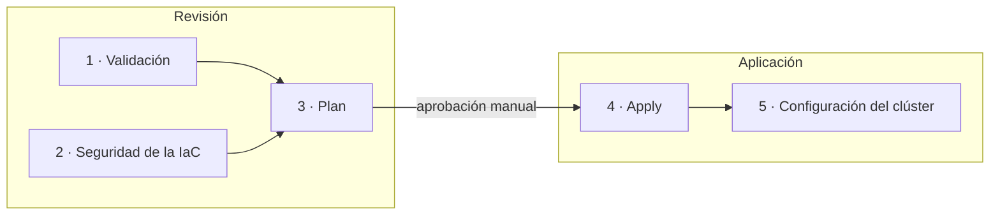

# CI/CD

Dos pipelines independientes en el mismo repositorio. Cada uno se dispara solo
cuando cambia lo suyo, así un cambio en la API no toca la infraestructura y al revés.

| Pipeline | Se dispara con cambios en | Grupos | Definición |
|---|---|---|---|
| Aplicación | `api/**`, `cicd/**` | **CI** y **CD** | [`app.yml`](../.github/workflows/app.yml) llama a [`app-ci.yml`](../.github/workflows/app-ci.yml) y [`app-cd.yml`](../.github/workflows/app-cd.yml) |
| Infraestructura | `iac/**` | **Revisión** y **Aplicación** | [`infra.yml`](../.github/workflows/infra.yml) llama a [`infra-review.yml`](../.github/workflows/infra-review.yml) e [`infra-apply.yml`](../.github/workflows/infra-apply.yml) |
| Rollback manual | A demanda | — | [`rollback.yml`](../.github/workflows/rollback.yml) |

Cada pipeline tiene un archivo que solo orquesta y un workflow reutilizable por
grupo. Así el gráfico de cada ejecución muestra los grupos como bloques, con sus
etapas adentro.

> GitHub Actions exige que los workflows vivan en `.github/workflows/`. En esta
> carpeta está todo lo demás del pipeline: los scripts que ejecutan las etapas
> (`scripts/`) y las pruebas de humo y de carga (`load-tests/`). Los scripts
> también se pueden correr a mano, sin GitHub.

## Pipeline de la aplicación

**CI** termina cuando hay una imagen probada, escaneada y publicada. **CD**
empieza cuando esa imagen se despliega.

| Grupo | Etapa | Qué hace | Qué la hace fallar |
|---|---|---|---|
| CI | **1 · Build y test** | Instala dependencias, corre las pruebas (`pytest`) y valida el chart de Helm | Una prueba rota o un chart inválido |
| CI | **2 · Calidad y seguridad** | `ruff` (estilo, errores y reglas de seguridad de bandit) y Trivy sobre el repositorio (dependencias vulnerables y secretos escritos en el código) | Código que no pasa el linter, una dependencia con vulnerabilidad alta/crítica corregible, o un secreto en el repo |
| CI | **3 · Build de imagen** | Construye la imagen `arm64` y la escanea con Trivy | Vulnerabilidad alta/crítica corregible en la imagen |
| CI | **4 · Push al registry** | Publica en ECR la misma imagen que se escaneó, con el SHA del commit como tag | — |
| CD | **5 · Deploy a staging** | Despliega con Helm, verifica la versión y corre una prueba de humo con k6 | Pods que no arrancan, versión incorrecta, errores o latencia alta |
| CD | **6 · Deploy a producción** | Igual que staging, tras **aprobación manual** | Lo mismo |

En un pull request corre CI hasta la etapa 3: se valida todo, pero no se publica ni se despliega.

Decisiones que vale la pena conocer:

- **Sin llaves guardadas.** El pipeline se autentica en AWS con OIDC y asume un rol
  que solo puede publicar en su repositorio de ECR y desplegar en sus dos namespaces.
- **Se construye una vez.** La imagen que pasa el escaneo viaja como artefacto a la
  etapa de push; lo que se probó en staging es, byte a byte, lo que llega a producción.
- **Tags inmutables.** El tag es el SHA del commit y ECR no permite sobrescribirlo.
- **El pipeline no conoce la infraestructura.** Nombre del clúster, URL del registry,
  dominios y nombre del secreto se leen de Parameter Store (`/nelua-api/...`).

## Estrategia de rollback

Volver atrás nunca reconstruye nada: como las imágenes son inmutables y siguen en
el registry, un rollback es apuntar de nuevo a una versión que ya funcionó. Hay
tres niveles, del más automático al manual:

| Nivel | Cuándo actúa | Cómo | Quién lo dispara |
|---|---|---|---|
| **1. Durante el despliegue** | Los pods nuevos no arrancan o no pasan el health check | `helm upgrade --wait --rollback-on-failure`: Helm deshace el cambio | Automático |
| **2. Después del despliegue** | Los pods arrancaron, pero la verificación de versión o la prueba de humo fallan | Paso **"Rollback automático"** del pipeline: `helm rollback` a la revisión anterior y nueva verificación | Automático |
| **3. Más tarde** | El problema aparece cuando el pipeline ya terminó en verde | Workflow **`rollback`** (botón *Run workflow*): elige entorno y, si quiere, revisión | Una persona |

Además, antes de llegar a esos niveles:

- **El tráfico nunca llega a un pod que no está listo.** El despliegue es gradual
  (`maxUnavailable: 0`): los pods viejos se retiran solo cuando los nuevos pasan el
  readiness. Una versión que no arranca no causa caída.
- **Producción solo recibe lo que ya pasó por staging**, con aprobación manual.

Detalles del nivel 2:

- Antes de desplegar, `deploy.sh` anota la revisión que está sirviendo. A esa
  revisión exacta vuelve el rollback, no "a la anterior que haya".
- El rollback no se da por bueno hasta que `verify.sh` confirma que el entorno
  responde con la versión restaurada.
- El pipeline queda **en rojo** aunque el rollback salga bien: el entorno está sano,
  pero la versión nueva no pasó y no avanza a producción.
- Es un paso dentro del mismo job, no un job aparte: un job aparte en `prod`
  volvería a pedir aprobación, y revertir no debe esperar a nadie.

Qué **no** cubre: cambios de datos. Esta API es de solo lectura y no tiene base de
datos, así que no hay migraciones que deshacer. Si las hubiera, tendrían que ser
compatibles hacia atrás para que el rollback del código siga siendo seguro.

El rollback se ve desde la propia API: en `GET /v1/deployments`, el historial del
servicio muestra la revisión activa con `reactivated: true`.

## Pipeline de infraestructura

En infraestructura los grupos no se llaman CI y CD porque no se construye ni se
despliega un artefacto: **Revisión** es todo lo que pasa antes de que alguien
apruebe (no crea ni modifica nada) y **Aplicación** es el cambio real.

| Grupo | Etapa | Qué hace |
|---|---|---|
| Revisión | **1 · Validación** | `terraform fmt -check` y `terraform validate` de los tres stacks |
| Revisión | **2 · Seguridad de la IaC** | `checkov`; las excepciones están justificadas junto a cada recurso |
| Revisión | **3 · Plan** | `terraform plan` por stack; en un pull request se publica como comentario |
| Aplicación | **4 · Apply** | Tras aprobación manual: stack `persistent` y, si `PLATFORM_ENABLED` es `true`, stack `platform` |
| Aplicación | **5 · Configuración del clúster** | Namespaces, pool de nodos, permisos de lectura de la API, enlace con el ALB y monitoreo |

Para infraestructura el rollback es `git revert` del cambio y un nuevo paso por el
pipeline: el plan muestra exactamente qué se va a deshacer antes de aprobarlo.

## Scripts

| Script | Uso |
|---|---|
| `scripts/deploy.sh <entorno> <tag>` | Despliega una versión con Helm |
| `scripts/verify.sh <entorno> [versión]` | Comprueba versión y endpoints desde la URL pública |
| `scripts/smoke.sh <entorno>` | Prueba de humo con k6 |
| `scripts/rollback.sh <entorno> [revisión]` | Vuelve a una revisión anterior y verifica |
| `load-tests/run-in-cluster.sh` | Prueba de carga de 10.000 RPS desde dentro del clúster |

## Configuración del repositorio

Variables (*Settings → Secrets and variables → Actions → Variables*):

| Variable | Valor |
|---|---|
| `AWS_APP_ROLE_ARN` | Rol del pipeline de la aplicación (salida `gha_app_role_arn` del stack bootstrap) |
| `AWS_INFRA_ROLE_ARN` | Rol del pipeline de infraestructura (salida `gha_infra_role_arn`) |
| `PLATFORM_ENABLED` | `true` para crear el clúster; `false` lo deja apagado |
| `DEPLOY_ENABLED` | `true` para desplegar; requiere la plataforma encendida |

Environments (*Settings → Environments*): `staging`, `prod` e `infra`. Los dos
últimos con *Required reviewers*.

No hay secretos en GitHub: ni llaves de AWS ni la API key.
