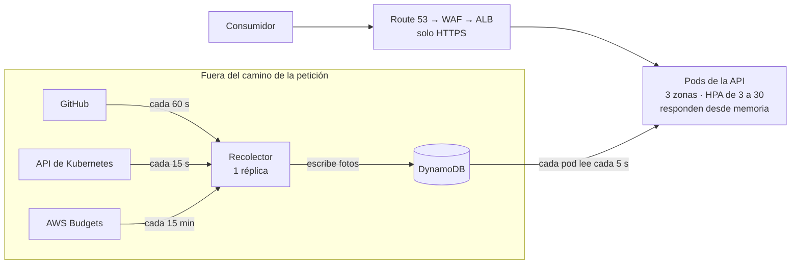
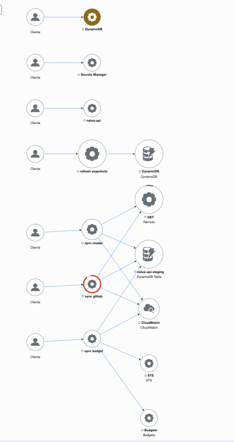
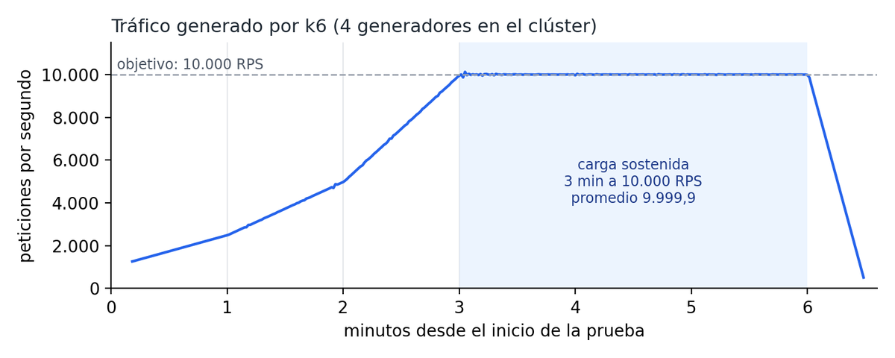
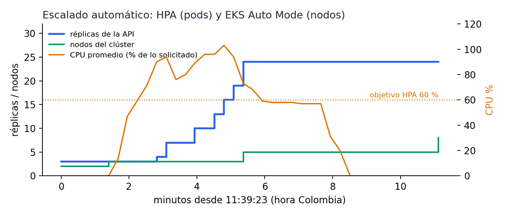
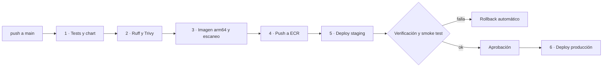
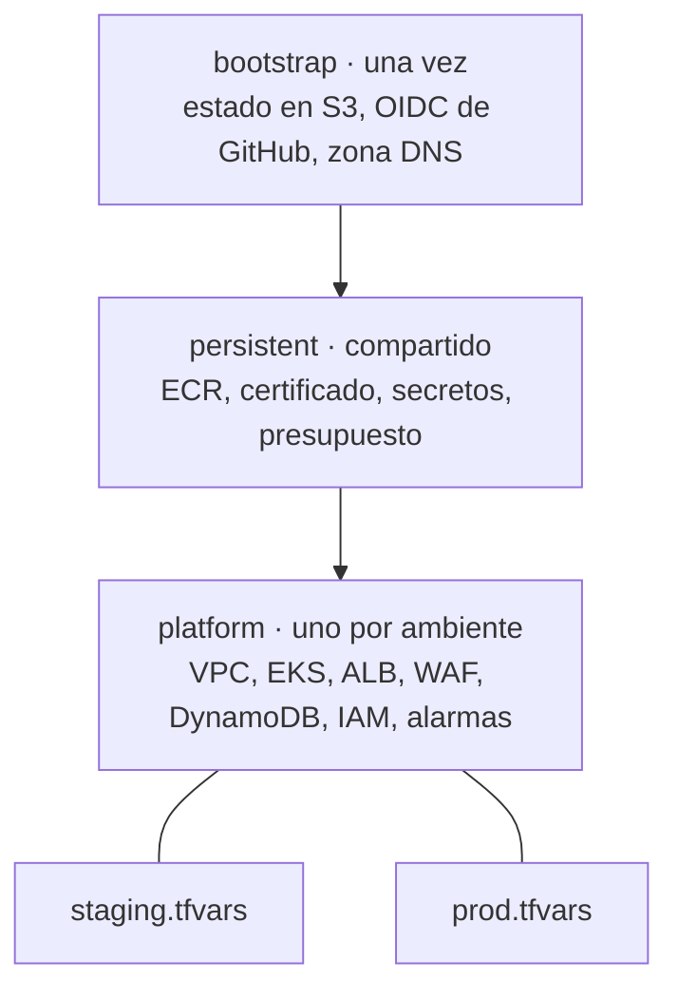
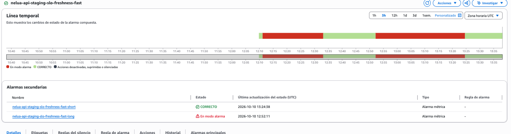
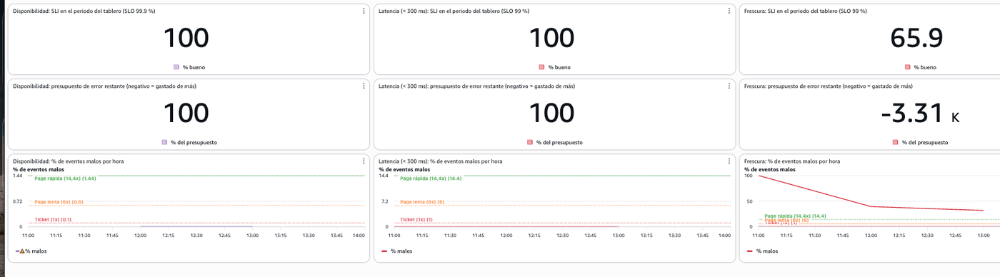
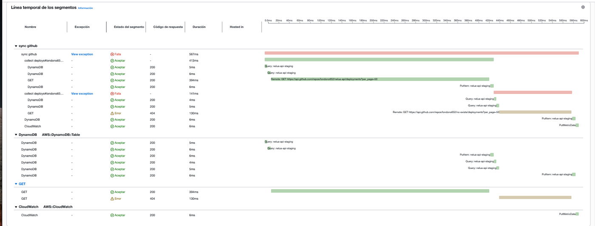

# nelua-api en 5 minutos

Una API para un equipo de plataforma que responde tres preguntas: **cómo vienen
saliendo los despliegues, en qué estado están los servicios y cuánto se lleva
gastado**. Corre en AWS (EKS), se despliega con GitHub Actions y toda la
infraestructura está en Terraform.

Este documento es el resumen. El razonamiento completo de cada decisión está en
[`decisiones.md`](decisiones.md).

| 10.000 RPS | 0 errores | p95 de 5,2 ms | 3 → 24 pods | 3 niveles de rollback | 3 SLOs con alertas |
|:---:|:---:|:---:|:---:|:---:|:---:|
| sostenidos 3 min | en 2,7 millones de peticiones | (el SLO es 300 ms) | solos, en ~3 min | automáticos y manual | y trazas distribuidas |

---

## 1. Cada objetivo del reto y cómo lo resolví

| Objetivo | Cómo lo resolví | Evidencia |
|---|---|---|
| **API REST** | FastAPI con 5 endpoints de solo lectura. Errores en formato RFC 9457 y documentación OpenAPI generada sola | [`api/`](../api), `/docs` |
| **Alta disponibilidad** | 3 zonas, pods repartidos entre ellas, PodDisruptionBudget, despliegue sin caída (`maxUnavailable: 0`) | Diagrama, sección 2 |
| **Exposición segura** | Solo HTTPS (443) con ACM, WAF con límite por IP, pods sin IP pública. API key en staging y Cognito con JWT validado en el ALB en producción | [`iac/`](../iac) |
| **Pico de 10.000 RPS** | La API responde desde memoria y escala con HPA (pods) y EKS Auto Mode (nodos) | Prueba de carga, sección 4 |
| **Secretos** | Secrets Manager. Sin llaves de AWS: GitHub entra por OIDC y los pods por Pod Identity, con un rol por componente | `iam_api.tf` |
| **Monitoreo** | SLOs con alertas por presupuesto de error, trazas con OpenTelemetry y X-Ray, Prometheus y Grafana | Sección 7 |
| **CI/CD con rollback** | Dos pipelines (app e infra). La misma imagen va de staging a producción. Rollback en 3 niveles | [`cicd/`](../cicd), sección 5 |
| **IaC** | Terraform en 3 stacks con estados separados, checkov y plan en cada PR, aplicar con aprobación | Sección 6 |
| *Deseable:* paridad sin datos sensibles | Mismo código, chart e imagen. Solo cambia el tamaño en `tfvars` y `values` | Sección 9 |
| *Deseable:* observabilidad con criterio | SLIs desde el consumidor, alertas por burn rate, trazas que encontraron un bug real | Sección 7 |
| *Deseable:* costo como variable | Graviton + Spot, DynamoDB bajo demanda, staging apagable, gasto visible en `/v1/budget` | Sección 8 |
| *Deseable:* cambio crítico fuera de horario | Primero revertir (un botón); nada a mano; todo por el pipeline | Sección 9 |

---

## 2. La arquitectura

---

## 3. La decisión que lo sostiene todo: la foto en memoria

Las fuentes son lentas y tienen límites (GitHub permite 5.000 peticiones por hora).
Por eso **las peticiones de los clientes nunca llegan a ellas**:

1. Un **recolector** consulta GitHub, Kubernetes y AWS Budgets, y guarda en
   DynamoDB una foto ya calculada de cada vista.
2. Cada **pod de la API** lee esas fotos cada 5 segundos y responde desde memoria.

**Resultado:** 10 o 10.000 peticiones por segundo generan la misma carga hacia
atrás. Si una fuente se cae, la API sigue respondiendo con la última foto y avisa
en la respuesta (`meta.stale` y `meta.sync`) que el dato está viejo y por qué.

El mapa de X-Ray lo muestra solo: `nelua-api` no tiene ninguna flecha de salida, y
todas las dependencias cuelgan del recolector.

---

## 4. ¿Soporta 10.000 RPS? Sí, medido

Prueba con k6 desde dentro del clúster, entrando por la URL pública (WAF, ALB y
pods), con la misma configuración de autoescalado que producción.

| Criterio | Umbral | Resultado |
|---|---|---|
| Tráfico sostenido | 10.000 RPS | 9.999,9 RPS de promedio durante 3 min |
| Errores | menos de 1 % | **0** de 2.727.636 |
| Latencia | p95 < 300 ms | **p95 5,2 ms**, p99 ~10 ms |
| Escalado | automático | 3 → 24 pods y 2 → 5 nodos, CPU estable en 57 % |

Cada pod atendió unos 417 RPS. Informe completo:
[`prueba-de-carga-nelua-api.docx`](prueba-de-carga-nelua-api.docx).

---

## 5. CI/CD con rollback

Se construye **una sola imagen**, con el SHA del commit como tag (ECR no deja
sobrescribirlo), y esa misma se promueve de staging a producción.

| Nivel | Cuándo actúa | Cómo |
|---|---|---|
| 1 | Los pods nuevos no arrancan | Helm deshace solo el cambio (`--rollback-on-failure`) |
| 2 | Arrancan, pero falla la verificación | Un paso del pipeline vuelve a la revisión anterior |
| 3 | El problema aparece después | Workflow `rollback`, un botón |

**Probado:** subí a propósito un error de configuración; la verificación lo
detectó y el rollback automático dejó la versión anterior sirviendo.

---

## 6. Infraestructura como código

- **Estados separados** por stack y por ambiente: un error en uno no arrastra a los demás.
- **Revisión antes de aplicar:** `fmt`, `validate`, checkov y plan de los dos
  ambientes en cada PR; aplicar pide aprobación.
- **Contrato en Parameter Store:** la infraestructura publica nombres y ARNs, y
  el pipeline de la app los lee. Ninguno conoce los detalles del otro.

---

## 7. Observabilidad con criterio

### SLOs medidos desde el consumidor

| SLI | SLO a 30 días | Presupuesto de error |
|---|---|---|
| Disponibilidad (sin 5xx, medido en el ALB) | 99,9 % | ≈ 43 min al mes |
| Latencia (menos de 300 ms) | 99 % | 1 % de peticiones lentas |
| **Frescura** (el recolector sincroniza) | 99 % | 1 % de sincronizaciones fallidas |

La frescura la agregué por cómo está hecha la API: si responde 200 con datos de
hace una hora, para quien la consulta está caída.

### Alertas por presupuesto, no por umbral

| Nivel | Condición | Acción |
|---|---|---|
| Rápido | Se gasta 14,4 veces más rápido de lo normal, en 1 h **y** en los últimos 5 min | Despierta a alguien |
| Lento | 6 veces más rápido, en 6 h **y** en los últimos 30 min | Despierta a alguien |
| Ticket | Al ritmo de agotarlo en el mes, 3 días seguidos | Ticket |

Así un pico de 30 segundos no despierta a nadie, y un 0,3 % de errores constante,
que ninguna alarma de umbral ve, abre un ticket antes de que se coma el mes.

**Probado en staging:** provoqué una falla de sincronización. La alarma saltó en
1–2 minutos y volvió a OK unos 5 minutos después de corregirla, aunque la ventana
de una hora seguía en rojo: para eso está la ventana corta.

### Trazas distribuidas

OpenTelemetry en la app → colector en el clúster → AWS X-Ray. Cada línea de log
lleva el mismo `trace_id` que la traza.

*Un ciclo de 567 ms: 394 son GitHub y DynamoDB responde en 4–6 ms. El repo que no
existe queda en rojo con el 404.*

**Lo primero que encontraron las trazas fue un bug real:** al recolector le
faltaba un permiso de IAM para leer su último estado al arrancar. El error estaba
en los logs, pero nadie lo veía. Lo corregí y lo verifiqué en la misma sesión.
Informe: [`observabilidad-nelua-api.docx`](observabilidad-nelua-api.docx).

---

## 8. Elecciones y lo que costaron

| Elegí | En lugar de | Gané | Pagué |
|---|---|---|---|
| **EKS Auto Mode** | ECS Fargate | Kubernetes estándar; AWS opera nodos, parches y escalado | Más piezas; recargo sobre las instancias |
| **ALB + WAF** | API Gateway | Sin cobro por petición, sin cuota de 10.000 RPS, sin una capa extra | Sin cuotas exactas por consumidor |
| **ALB + WAF** | CloudFront | Simplicidad: la API ya responde desde memoria | Sin caché en el borde |
| **Foto en memoria + DynamoDB** | Consultar las fuentes en cada petición | La carga hacia atrás no crece con el tráfico | Datos con hasta ~1 min de retraso (y la respuesta lo dice) |
| **DynamoDB** | ElastiCache (Redis) | Sin servidores, multi-zona, con historia y TTL, centavos al mes | Latencia mayor, que no se nota: se lee cada 5 s |
| **Un recolector, 1 réplica** | Que cada pod consulte | 1 cliente hacia GitHub en vez de 30 | Si se cae, solo se pierde frescura unos segundos |
| **Un clúster por ambiente** | Un clúster con namespaces | Las actualizaciones se prueban primero en staging | Dos planos de control (producción queda apagada) |
| **Python + FastAPI** | Go | Lo lee y mantiene un equipo de infraestructura | Menos RPS por proceso; se compensa con el diseño y más pods |
| **API key en staging** | Cognito en los dos | Probar a mano y la carga es simple | La validación del JWT no se prueba antes de producción |

---

## 9. Costo, paridad y cambios de madrugada

**Costo.** Graviton + Spot (la API no tiene estado), DynamoDB bajo demanda, topes
de escalado (200 vCPU, 30 pods) y todo lo que cobra por hora se apaga por ambiente.

| Ambiente | USD/mes aprox. (en reposo) |
|---|---|
| Staging | 190 – 230 |
| Producción (3 NAT) | 255 – 295 |

A 10.000 RPS **sostenidos** lo más caro ya no es el cómputo sino el WAF, que cobra
por petición (del orden de 15.000 USD/mes). Por eso el diseño asume un pico, no
tráfico constante.

**Paridad.** Mismo Terraform, mismo chart, misma imagen. Lo que cambia (réplicas,
NAT, autenticación) está a la vista en `envs/*.tfvars` y `values-*.yaml`. Cada
ambiente tiene sus secretos, su tabla y sus roles. La API no guarda datos de
clientes, así que no hay nada sensible que copiar.

**Un cambio crítico a las 3 a. m.** Primero revertir: el workflow `rollback` no
construye nada. Si hay que sacar un arreglo, va por el pipeline completo. Nadie
toca producción a mano; existe un acceso de emergencia que deja rastro en
CloudTrail. Solo se justifica fuera de horario un incidente en curso o una
vulnerabilidad explotada.

---

## 10. Con más tiempo

- Despliegue canary (Argo Rollouts), para que una versión mala no reciba todo el tráfico.
- Cognito también en staging, una cuenta de AWS por ambiente y un rol de solo lectura para el `plan`.
- Muestreo por cola de las trazas (guardar todas las que tienen error o son lentas).
- Webhooks de GitHub en lugar de consultar cada minuto.
